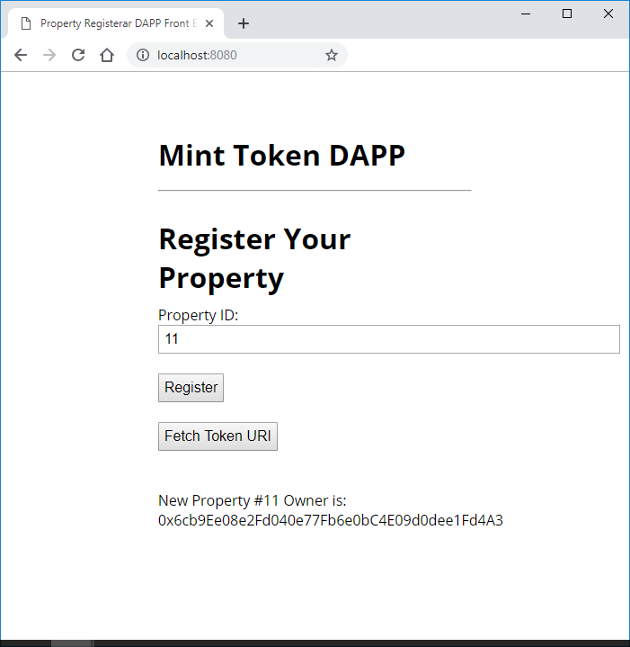

# Udacity Blockchain Capstone

The capstone will build upon the knowledge you have gained in the course in order to build a decentralized housing product. 

Contract 'SquareVerifier'
--------------------------
> contract address:    0x8F8e9fAFB101a75916BD7a78E9cc807A4Ec7CA0C

Contract 'SolnSquareVerifier'
------------------------------
> contract address:    0x01162189997964b5f107ED7b476e1D335438B9b2

Open Sea remaining assets: https://rinkeby.opensea.io/accounts/0x6cb9ee08e2fd040e77fb6e0bc4e09d0dee1fd4a3

Open Sea assets sold:

https://rinkeby.opensea.io/assets/0x01162189997964b5f107ed7b476e1d335438b9b2/1
https://rinkeby.opensea.io/assets/0x01162189997964b5f107ed7b476e1d335438b9b2/2
https://rinkeby.opensea.io/assets/0x01162189997964b5f107ed7b476e1d335438b9b2/3
https://rinkeby.opensea.io/assets/0x01162189997964b5f107ed7b476e1d335438b9b2/4
https://rinkeby.opensea.io/assets/0x01162189997964b5f107ed7b476e1d335438b9b2/5

Buyer: 0x954cB087C29cf91FDFfd6A144F2F7bBc8b87e1bA bought these
https://rinkeby.opensea.io/assets/0x01162189997964b5f107ed7b476e1d335438b9b2/1
https://rinkeby.opensea.io/assets/0x01162189997964b5f107ed7b476e1d335438b9b2/5

Buyer: 0x633a8104BCe1a9d0118599B6c540136587F2c1FD bought these: 
https://rinkeby.opensea.io/assets/0x01162189997964b5f107ed7b476e1d335438b9b2/2
https://rinkeby.opensea.io/assets/0x01162189997964b5f107ed7b476e1d335438b9b2/3
https://rinkeby.opensea.io/assets/0x01162189997964b5f107ed7b476e1d335438b9b2/4

## Install

To install, download or clone the repo, then:

`npm install`

1. Start Ganache like below .

`ganache-cli` 

2. In a separate terminal window,from inside the directory      eth-contracts/ Compile smart contracts:

    `truffle compile`

    This will create the smart contract artifacts in folder build\contracts.

3. Then compile and deploy with truffle.

`truffle migrate --network development --reset --compile-all`

## Testing
  To run truffle tests from inside the directory eth-contracts/:

`truffle test`

## Minting a Token
In a separate terminal window, launch the DApp:

npm run dev

To view dapp

`http://localhost:8080`

to register your property, fill property id and click register:

# Project Resources

* [Remix - Solidity IDE](https://remix.ethereum.org/)
* [Visual Studio Code](https://code.visualstudio.com/)
* [Truffle Framework](https://truffleframework.com/)
* [Ganache - One Click Blockchain](https://truffleframework.com/ganache)
* [Open Zeppelin ](https://openzeppelin.org/)
* [Interactive zero knowledge 3-colorability demonstration](http://web.mit.edu/~ezyang/Public/graph/svg.html)
* [Docker](https://docs.docker.com/install/)
* [ZoKrates](https://github.com/Zokrates/ZoKrates)
